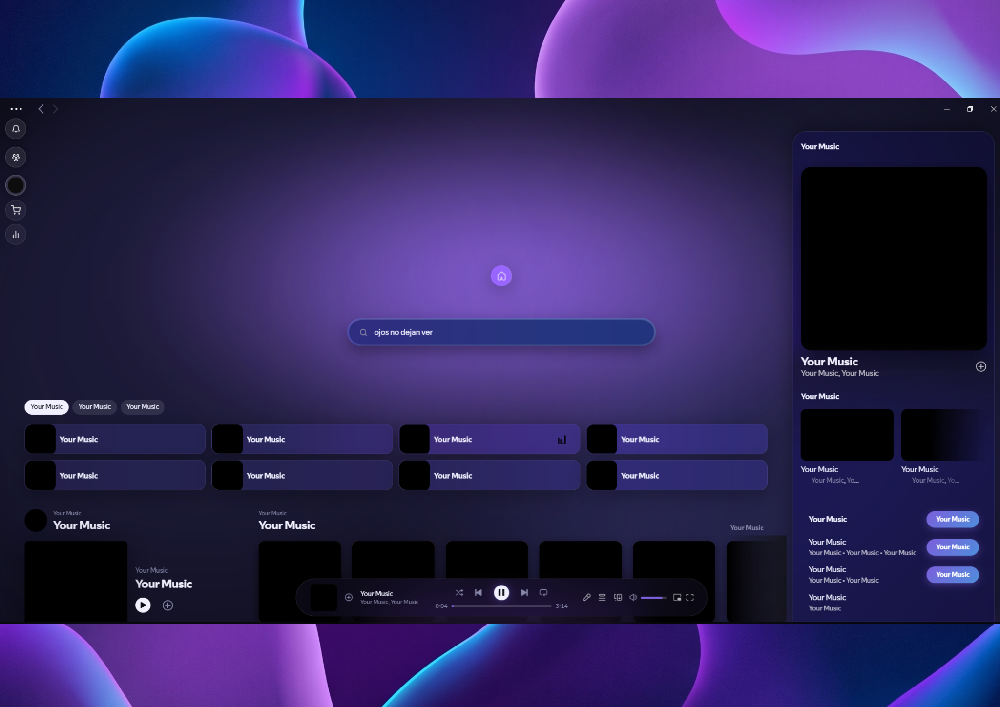

# AmbientGlass ✦ Premium Spicetify Theme

AmbientGlass is a state-of-the-art Spicetify theme inspired by modern glassmorphism and Apple-style aesthetics. It transforms your Spotify into a vibrant, atmospheric experience with floating UI elements and dynamic glows.



## ✨ Features

*   **Floating Home Cluster**: A sleek, minimal navigation dock that expands on hover.
*   **Centered Search Experience**: A cinematic search bar with ring animations that docks smoothly on scroll.
*   **Theme Settings Panel**: Real-time customization for colors, glows, and glass effects.
*   **Frosted Glass Customization**: Adjustable blur intensity and premium reflections.
*   **Privacy Mode**: One-click protection that hides artist/song names and images.
*   **Atmospheric Blobs**: Vibrant, blurred background elements that create depth and mood.
*   **Cinematic Startup**: A custom intro animation to start your session in style.

## 🚀 Installation

1.  Make sure you have [Spicetify](https://spicetify.app/) installed.
2.  Open the Spicetify Marketplace.
3.  Search for **AmbientGlass**.
4.  Click **Install**.

*Alternatively, for manual installation:*
1.  Place the `AmbientGlass` folder into your Spicetify `Themes` directory.
2.  Run:
    ```bash
    spicetify config current_theme AmbientGlass
    spicetify apply
    ```

## 🎨 Credits

Made with ♥ by **EROX**.

---

*For issues or feedback, please visit the GitHub repository.*
